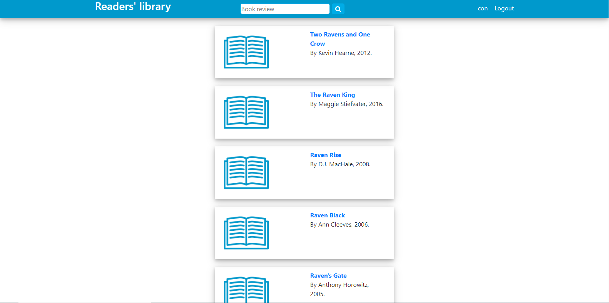
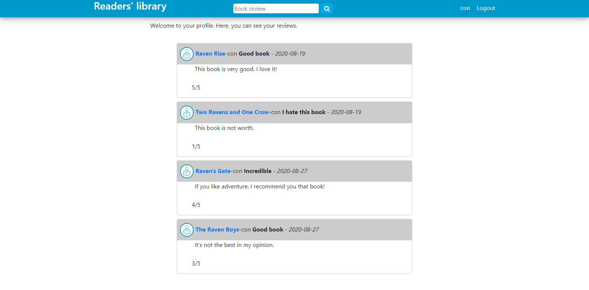

# Readers-library

This is an example of what the application looks like.

<i>Image 1. The first page. Users can login or register.</i>

<i>Image 2. The login page.</i>

<i>Image 3. Results page.</i>

<i>Image 4. .</i>

<i>Image 5. .</i>
